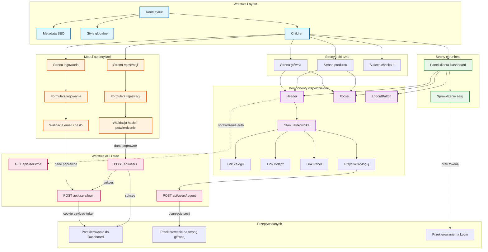

# Diagram UI – moduł logowania i rejestracji

<architecture_analysis>

## 1. Komponenty wymienione w PRD i istniejące w projekcie

**Strony (Next.js App Router):**

- Strona główna (`/`) – `page.tsx` w `(frontend)`
- Logowanie (`/login`) – `login/page.tsx`
- Rejestracja (`/register`) – `register/page.tsx`
- Panel klienta (`/dashboard`) – `dashboard/page.tsx`
- Szczegóły produktu (`/products/[slug]`) – `products/[slug]/page.tsx`
- Sukces checkout (`/checkout/success`) – `checkout/success/page.tsx`

**Layout:**

- `RootLayout` – `layout.tsx` (metadata, html/body, wspólne style)

**Komponenty współdzielone:**

- `Header` – nawigacja, logo, linki (Produkty, O mnie, Opinie), stan auth, przyciski Zaloguj / Dołącz / Panel / Wyloguj
- `Footer` – logo, linki (Polityka, Regulamin, Kontakt), ikony social
- `LogoutButton` – używany na Dashboard (wylogowanie)

**Komponenty specyficzne dla stron:**

- Strona główna: `HeroSection`, `ProductsSection`, `AboutSection`, `TestimonialsSection`
- Produkty: `ProductCard`, `BuyButton`
- Strona produktu: `ProductImage`, `ProductInfo`, `RichTextContent`, `BuyButton`
- Dashboard: `OrderCard`, lista zamówień, przyciski Pobierz

**Moduł autentykacji (strony + komponenty):**

- Strona Logowania: formularz (email, hasło), walidacja, wywołanie `/api/users/login`, przekierowanie do Dashboard
- Strona Rejestracji: formularz (email, hasło, potwierdzenie hasła), walidacja (min 8 znaków, zgodność haseł), wywołanie `/api/users` (POST), automatyczne logowanie, przekierowanie do Dashboard
- Header: sprawdzenie stanu auth przez `/api/users/me`, wyświetlenie Zaloguj/Dołącz lub Panel/Wyloguj

## 2. Główne strony i odpowiadające im komponenty

| Strona        | Ścieżka             | Komponenty strony                                               | Współdzielone                       |
| ------------- | ------------------- | --------------------------------------------------------------- | ----------------------------------- |
| Strona główna | `/`                 | HeroSection, ProductsSection, AboutSection, TestimonialsSection | Header, Footer                      |
| Logowanie     | `/login`            | Formularz logowania (email, hasło)                              | (bez Header/Footer – własny layout) |
| Rejestracja   | `/register`         | Formularz rejestracji (email, hasło, potwierdzenie)             | (bez Header/Footer)                 |
| Dashboard     | `/dashboard`        | Lista zamówień, OrderCard, LogoutButton                         | Header (własny), Footer             |
| Produkt       | `/products/[slug]`  | ProductImage, ProductInfo, BuyButton                            | Header, Footer                      |
| Sukces        | `/checkout/success` | Komunikat podziękowania                                         | (zależnie od implementacji)         |

## 3. Przepływ danych między komponentami

- **Layout → dzieci:** przekazuje tylko `children`; metadata w RootLayout.
- **Header:** pobiera stan użytkownika z `GET /api/users/me` (useEffect), wyświetla linki auth; wylogowanie przez `POST /api/users/logout`.
- **Strona logowania:** formularz → `POST /api/users/login` (email, password) → cookie `payload-token` → przekierowanie na `/dashboard`.
- **Strona rejestracji:** formularz → walidacja (hasło ≥ 8 znaków, hasła zgodne) → `POST /api/users` → `POST /api/users/login` → cookie → przekierowanie na `/dashboard`.
- **Dashboard:** odczyt cookie, `payload.auth()` po stronie serwera (lub odpowiednik), pobranie zamówień przez Payload Local API; niezalogowany → redirect na `/login`.
- **BuyButton:** `createCheckoutSession` (productId, opcjonalnie customerEmail) → Stripe Checkout URL → przekierowanie.

## 4. Krótki opis funkcjonalności komponentów

- **RootLayout:** Ustawia metadata, lang="pl", importuje style globalne, renderuje `children`.
- **Header:** Nawigacja, logo TrainerPro, linki sekcji, sprawdzenie auth (`/api/users/me`), przyciski Zaloguj/Dołącz lub Panel/Wyloguj, menu mobilne.
- **Footer:** Logo, linki (Polityka, Regulamin, Kontakt), ikony social.
- **Strona logowania:** Formularz email + hasło, walidacja, POST do API, obsługa błędów, przekierowanie po sukcesie.
- **Strona rejestracji:** Formularz email + hasło + potwierdzenie, walidacja (8 znaków, zgodność), POST rejestracji, automatyczne logowanie, przekierowanie.
- **LogoutButton:** POST `/api/users/logout`, refresh, przekierowanie.
- **Dashboard:** Weryfikacja sesji (cookies), lista zamówień paid, OrderCard z przyciskiem Pobierz.
- **BuyButton:** Inicjacja sesji Stripe Checkout, obsługa zalogowanego użytkownika (email).

</architecture_analysis>

---

<mermaid_diagram>

</mermaid_diagram>

---

## Uwagi do diagramu

- **RootLayout** obejmuje metadata i style; nie zawiera Header/Footer – te są dodawane w poszczególnych stronach.
- **Moduł autentykacji** obejmuje strony logowania i rejestracji oraz ich formularze i walidację.
- **Header** jest wspólny dla strony głównej, produktu i dashboardu; stan auth pochodzi z `GET /api/users/me`.
- **Strony chronione** (np. Dashboard) zależą od sprawdzenia sesji; przy braku tokena następuje przekierowanie na login.
- Stylami wyróżniono: layout (niebieski), autentykację (pomarańczowy), strony chronione (zielony), komponenty współdzielone (fioletowy), API (różowy).
